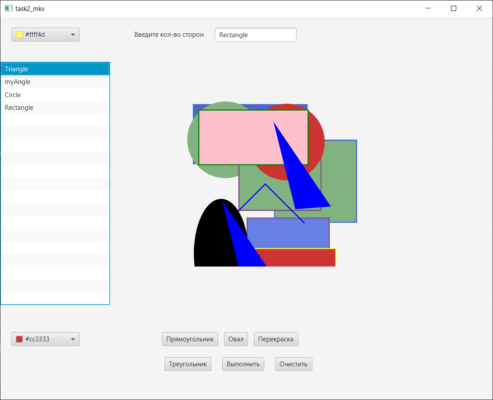
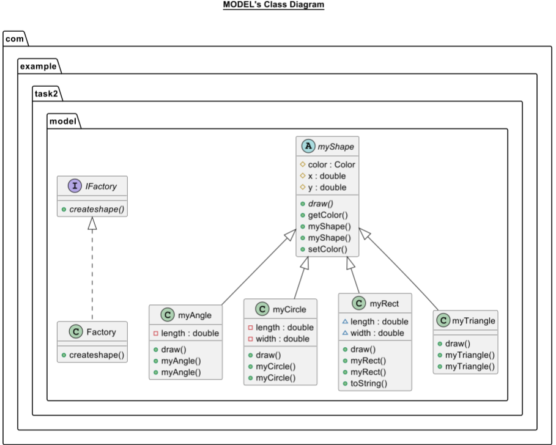

# Фабричный метод (Task 2)

---
**Описание:**

> Требуется написать программу, которая  рисует фигуру по заданному пользователем числу сторон
> (0-круг, 1-отрезок, 2-угол, 3-треугольник и т.д)

**Технологический стек**:
* JAVA
* JavaFX

**Скриншоты**
* Фото работы программы
  

## Архитектура

---

## Зависимости

---
Язык разработки Java.
Для создания пользовательского интерфейса используется платформа JavaFX.

## Приглашение к сотрудничеству
